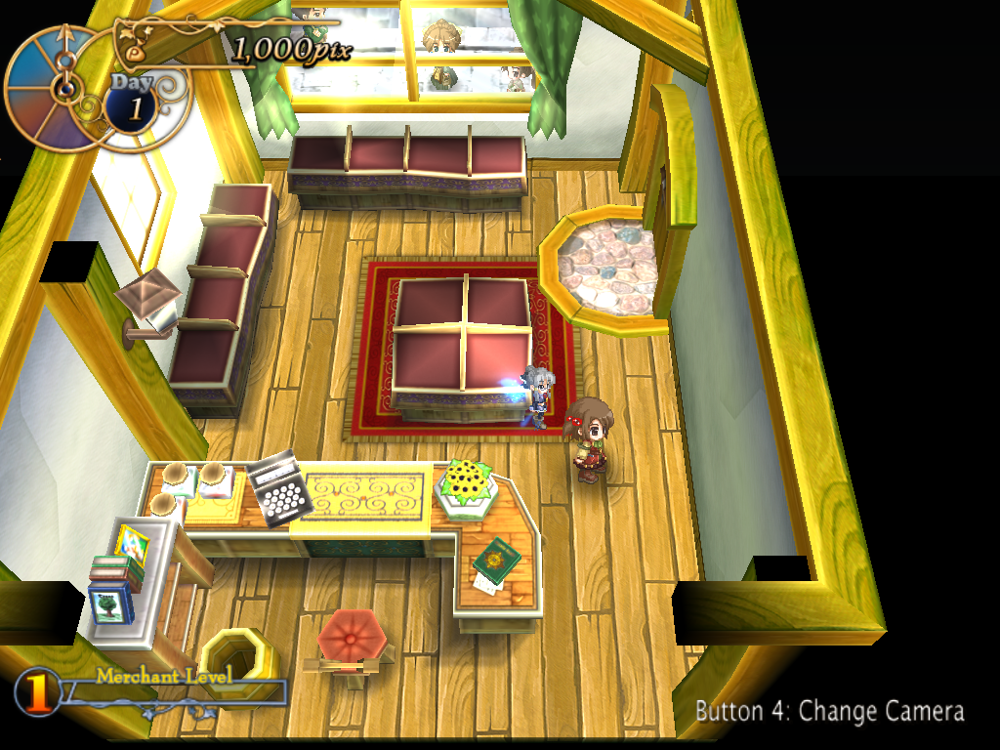
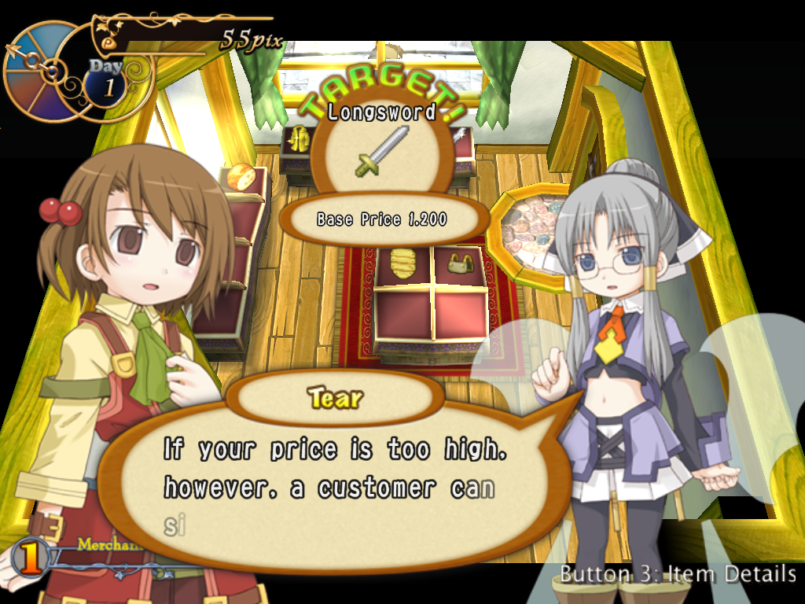

# OpenRecet

An open-source, clean-room-style C reimplementation of the Win32 engine
("Azumanga") behind **Recettear: An Item Shop's Tale** (EasyGameStation,
2007 / Carpe Fulgur EN, 2010) — aiming at a drop-in replacement for
`recettear.exe` that behaves like the original for people who own a
legitimate copy of the game.

This is an **educational reverse-engineering and game-preservation
project**. It ships **no game assets, no decompiled binary, and no
copyrighted content** — you bring your own copy of the game. MIT licensed
(our code only; no rights to the original game are granted).


*OpenRecet on an opening-prologue iv1_2 dialogue line: the dialogue box and
nameplate, both character standees, the spell-circle effect, and the top HUD
(clock / day / money) the engine draws over the live map — with the townsfolk
drifting past the back window. Every shot below is a real OpenRecet frame,
verified bit-for-bit against the original engine on the same deterministic input
trace (we no longer print them side by side — on the beats we showcase, the port
matches retail 1:1).*

More OpenRecet captures from the same deterministic traces:



*Free-roaming in the shop: the 3D room (geometry, textures, lighting, window
god-rays), the persistent top HUD (clock / day / money), the "Change Camera"
hint, Recette, and a townsperson drifting past the back window.*



*Haggling with a customer over a sale: the "Bargain!" price gauge, the item's
base price, the customer's reaction, and the item-details hint — the
customer-service negotiation UI rendered over the live shop.*

In memory of Andrew Dice / [@SpaceDrakeCF](https://x.com/SpaceDrakeCF)
and Carpe Fulgur.

## Status — early, not yet playable

This is **early-stage** and **not playable yet**. A real boot path runs
(title → new game → the 3D shop interior renders), but large subsystems
are unported and there is no end-to-end gameplay. The screenshot above is
the kind of milestone that's working today; **screenshots here get
refreshed on major breakthroughs**, so treat them as a high-water mark,
not a promise of completeness.

For the actual state of things — what's ported, verified, or untouched,
function by function — see the live status pages (these are generated
from the source, not hand-maintained marketing):

- **[`docs/STATUS.md`](docs/STATUS.md)** — 60-second headline:
  port-coverage counts and the current front.
- **[`docs/port-ledger.md`](docs/port-ledger.md)** — per-function port
  status for all ~2,550 engine functions.
- **[`docs/PROGRESS.md`](docs/PROGRESS.md)** — dated narrative changelog.

The generated status is the only authoritative source for changing counts.
Its current function labels are implementation/source-instrumentation inventory,
not a claim that every labelled function has full behavioral proof; the proof-ledger
migration is scoped in
[`docs/plans/parity-evidence-roadmap.md`](docs/plans/parity-evidence-roadmap.md).

## How it's verified

Correctness is measured as **behavioural parity against the original
binary**, not guesswork:

- **Direct3D 8 command-stream traces** captured from both the port and
  retail and replayed/diffed draw-call by draw-call — this is how the
  shop's brightness, window blinds, and god-rays above were pinned to 1:1.
- **Call-trace diffing** — per-frame function-call sequences compared
  between port and retail to catch missing or divergent logic.
- **Frame captures** — port-vs-retail image comparisons at fixed frames.
- **A large host unit suite** for portable decoders and game logic, run
  under AddressSanitizer + UndefinedBehaviorSanitizer on C changes.

Methodology lives in
[`docs/plans/parity-evidence-roadmap.md`](docs/plans/parity-evidence-roadmap.md),
the operational trace guide in
[`docs/trace-workflow.md`](docs/trace-workflow.md), and delegation conventions in
[`docs/AGENT-WORKFLOW.md`](docs/AGENT-WORKFLOW.md).

## Building & running

You need **your own legitimately-owned copy of Recettear** — the build
ships no assets, and on first run the port reads the game's sound effects
out of your own retail `recettear.exe` and caches them locally (it never
redistributes them; see [`docs/formats/se-pack.md`](docs/formats/se-pack.md)).

```sh
nix develop            # dev shell: mingw-w64 32-bit cross compiler + RE toolchain
make -C src            # cross-compiles build/openrecet.exe (+ openrecet-debug.exe)
make -C tests run      # the host unit-test suite
```

Place the resulting `openrecet.exe` in your Recettear install folder
(alongside `recettear.exe`, which it reads SE from) and run it. The exact
reference binary all of this targets is documented in
[`docs/reference/vendor-exe.md`](docs/reference/vendor-exe.md).

Pre-built nightly binaries are published as a rolling
[`nightly`](https://github.com/Francesco149/openrecet/releases/tag/nightly) pre-release (unsigned; bring your
own Recettear).

## Repository layout

```
docs/     design notes, file-format specs, RE findings, status pages
src/      the C reimplementation (cross-compiled with mingw32)
tests/    host unit tests, golden-frame diffs, format-decoder tests
tools/    build/run harness, extractors, Frida capture, CI scripts
```

## Support & how this is made

This project's reverse-engineering, implementation, and documentation are
**AI-assisted and maintainer-directed**. Different reasoning systems may be used for
architecture, implementation, searches, and verification; the repository records
evidence and reasoning tiers rather than presenting one model name as permanent
provenance. The methodology is intended to be reproducible and auditable.

If you'd like to support the work: **[ko-fi.com/lolisamurai](https://ko-fi.com/lolisamurai)**.
Donations go toward the AI compute that does the work — roughly **€240 ≈
one month of intense RE**, spread across a few projects in parallel to use
the subscription efficiently. **Games suggested in donations will be
considered as future RE targets.**

## Legal

OpenRecet is an independent, unofficial project and is **not affiliated
with or endorsed by EasyGameStation or Carpe Fulgur**. It contains none
of the original game's assets or code and requires you to own a legitimate
copy of Recettear (Steam App ID 70400). All trademarks belong to their
respective owners. OpenRecet's own source is released under the
[MIT license](LICENSE).
</content>
