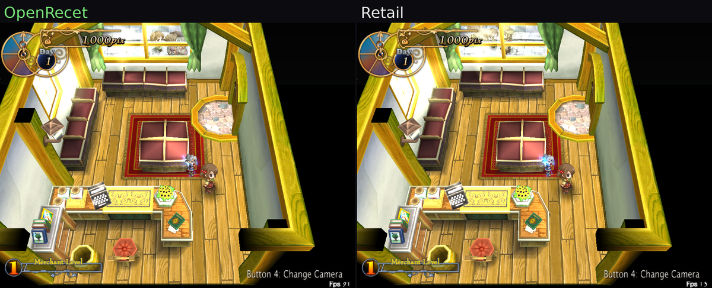
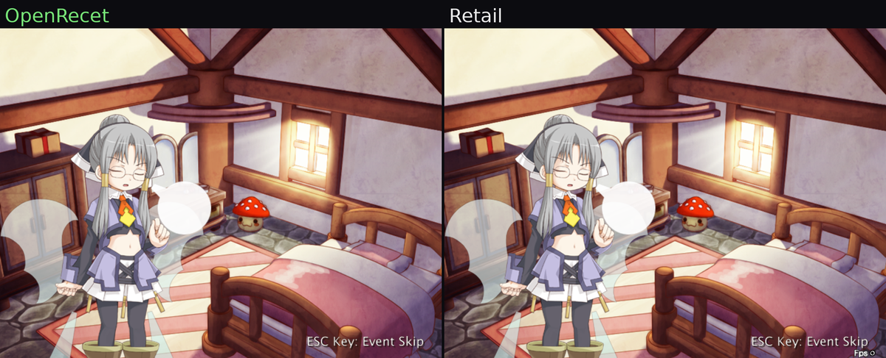
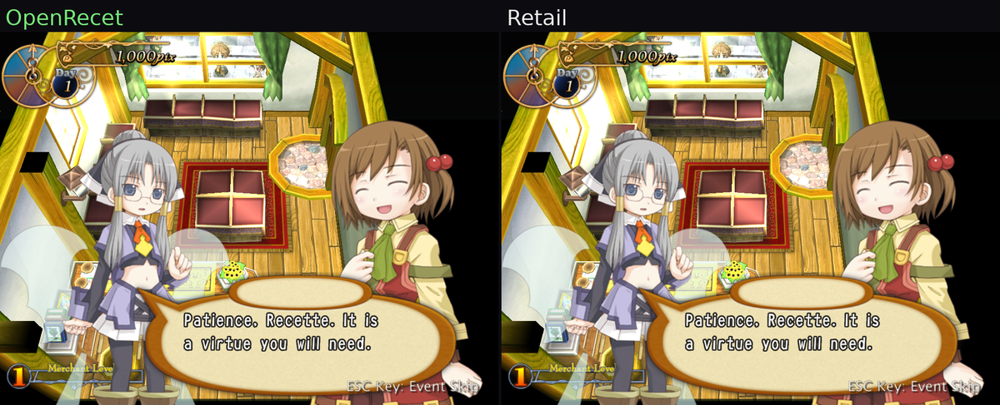

# OpenRecet

An open-source, clean-room-style C reimplementation of the Win32 engine
("Azumanga") behind **Recettear: An Item Shop's Tale** (EasyGameStation,
2007 / Carpe Fulgur EN, 2010) — aiming at a drop-in replacement for
`recettear.exe` that behaves like the original for people who own a
legitimate copy of the game.

This is an **educational reverse-engineering and game-preservation
project**. It ships **no game assets, no decompiled binary, and no
copyrighted content** — you bring your own copy of the game. MIT licensed
(our code only; no rights to the original game are granted).



*OpenRecet (left) next to the original engine (right), free-roaming in the
shop. The 3D room (geometry, textures, lighting, window god-rays), the
persistent top HUD (clock / day / money), the "Change Camera" hint, the FPS
overlay, Recette, and the townsfolk drifting past the back window are all
reproduced close to 1:1. (The NPCs' exact drift phase isn't pinned yet, so
they're at slightly different spots in the two windows.)*

A few more side-by-sides from the opening — each is OpenRecet (left) vs the
retail engine (right), captured from the same deterministic input trace:





*Top to bottom: the iv1_1 "sigh" effect sprite mid-fade (full-screen
cutscene, no HUD); a zoom on Recette's look-up pose at the iv1_2 opening; and
an iv1_2 dialogue line — note the top HUD, which the engine draws over the
live map during iv1_2 but suppresses behind iv1_1's full-screen background.*

In memory of Andrew Dice / [@SpaceDrakeCF](https://x.com/SpaceDrakeCF)
and Carpe Fulgur.

## Status — early, not yet playable

This is **early-stage** and **not playable yet**. A real boot path runs
(title → new game → the 3D shop interior renders), but large subsystems
are unported and there is no end-to-end gameplay. The screenshot above is
the kind of milestone that's working today; **screenshots here get
refreshed on major breakthroughs**, so treat them as a high-water mark,
not a promise of completeness.

For the actual state of things — what's ported, verified, or untouched,
function by function — see the live status pages (these are generated
from the source, not hand-maintained marketing):

- **[`docs/STATUS.md`](docs/STATUS.md)** — 60-second headline:
  port-coverage counts and the current front.
- **[`docs/port-ledger.md`](docs/port-ledger.md)** — per-function port
  status for all ~2,550 engine functions.
- **[`docs/PROGRESS.md`](docs/PROGRESS.md)** — dated narrative changelog.

At a glance right now: ~14% of the engine's non-thunk functions are
touched (a few percent runtime-verified against the original). Once the
game is mostly playable this section will turn into a short "known issues"
list instead.

## How it's verified

Correctness is measured as **behavioural parity against the original
binary**, not guesswork:

- **Per-draw Direct3D state traces** captured from both the port and
  retail (via Frida) and diffed draw-call by draw-call — this is how the
  shop's brightness, window blinds, and god-rays above were pinned to 1:1.
- **Call-trace diffing** — per-frame function-call sequences compared
  between port and retail to catch missing or divergent logic.
- **Frame captures** — port-vs-retail image comparisons at fixed frames.
- **2,900+ host unit tests** for the portable decoders and game logic,
  run under AddressSanitizer + UndefinedBehaviorSanitizer on every
  C change.

Methodology lives in [`docs/AGENT-WORKFLOW.md`](docs/AGENT-WORKFLOW.md)
and [`docs/harness-roadmap.md`](docs/harness-roadmap.md).

## Building & running

You need **your own legitimately-owned copy of Recettear** — the build
ships no assets, and on first run the port reads the game's sound effects
out of your own retail `recettear.exe` and caches them locally (it never
redistributes them; see [`docs/formats/se-pack.md`](docs/formats/se-pack.md)).

```sh
nix develop            # dev shell: mingw-w64 32-bit cross compiler + RE toolchain
make -C src            # cross-compiles build/openrecet.exe (+ openrecet-debug.exe)
make -C tests run      # the host unit-test suite
```

Place the resulting `openrecet.exe` in your Recettear install folder
(alongside `recettear.exe`, which it reads SE from) and run it. The exact
reference binary all of this targets is documented in
[`docs/reference/vendor-exe.md`](docs/reference/vendor-exe.md).

Pre-built nightly binaries are published as a rolling
[`nightly`](../../releases/tag/nightly) pre-release (unsigned; bring your
own Recettear).

## Repository layout

```
docs/     design notes, file-format specs, RE findings, status pages
src/      the C reimplementation (cross-compiled with mingw32)
tests/    host unit tests, golden-frame diffs, format-decoder tests
tools/    build/run harness, extractors, Frida capture, CI scripts
```

## Support & how this is made

This project's reverse-engineering and documentation is **done entirely
by AI** (Anthropic's Claude), directed by the maintainer. That's both an
honest disclosure and, hopefully, an interesting demonstration of what
AI-driven RE can do — the methodology is meant to be reproducible.

If you'd like to support the work: **[ko-fi.com/lolisamurai](https://ko-fi.com/lolisamurai)**.
Donations go toward the AI compute that does the work — roughly **€240 ≈
one month of intense RE**, spread across a few projects in parallel to use
the subscription efficiently. **Games suggested in donations will be
considered as future RE targets.**

## Legal

OpenRecet is an independent, unofficial project and is **not affiliated
with or endorsed by EasyGameStation or Carpe Fulgur**. It contains none
of the original game's assets or code and requires you to own a legitimate
copy of Recettear (Steam App ID 70400). All trademarks belong to their
respective owners. OpenRecet's own source is released under the
[MIT license](LICENSE).
</content>
